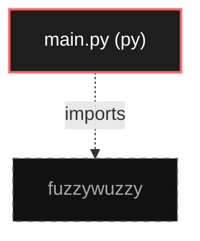

# Polyglot Codebase Knowledge Graph

> Generated offline by **readmenator**. Supports C, C++, Python, Go, Rust, JS/TS, Java, C#, Shell, PHP, Dart, GDScript, Nim, ASM.
> No LLMs. No tokens. Pure static analysis. See more [here](https://github.com/grisuno/ReadMenator)

**Total Files Parsed:** 1 | **Total Symbols Extracted:** 0 | **Total Imports:** 1

## Structural Knowledge Map

---

## Architecture Reference

### PY (1 files)

#### `main.py`
**Path:** `main.py`

*No symbols extracted*
